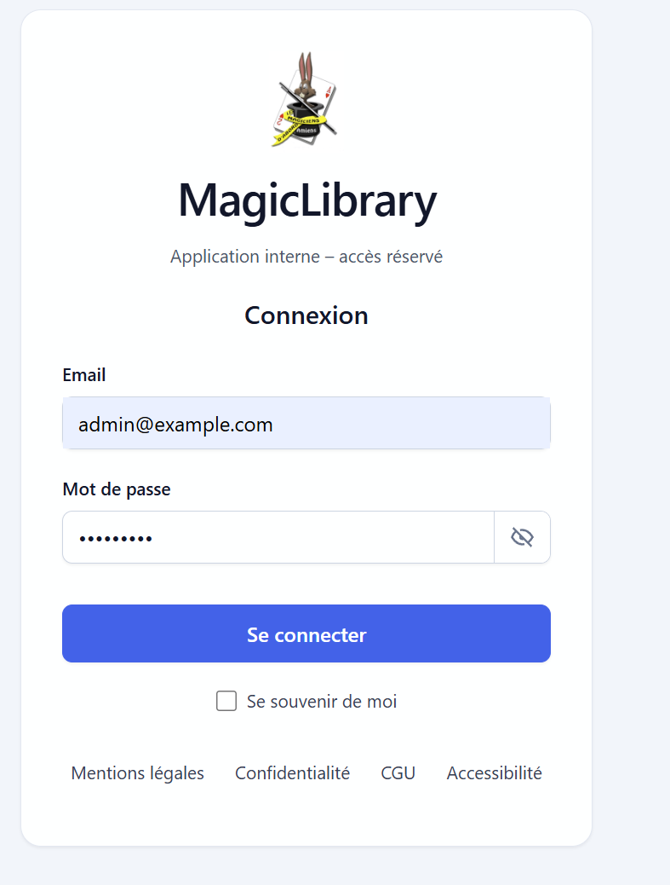
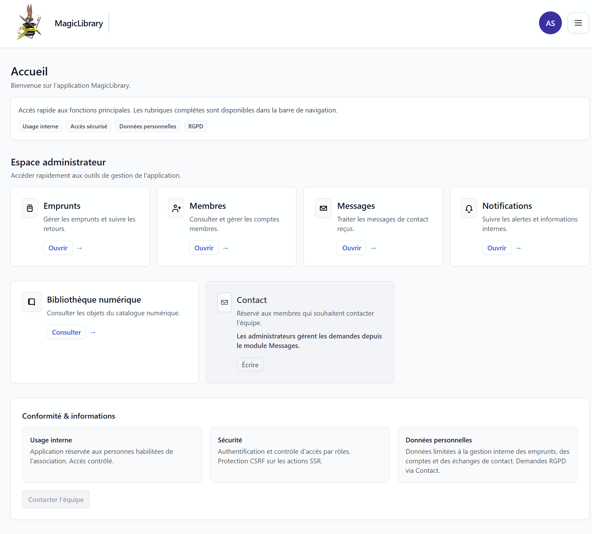
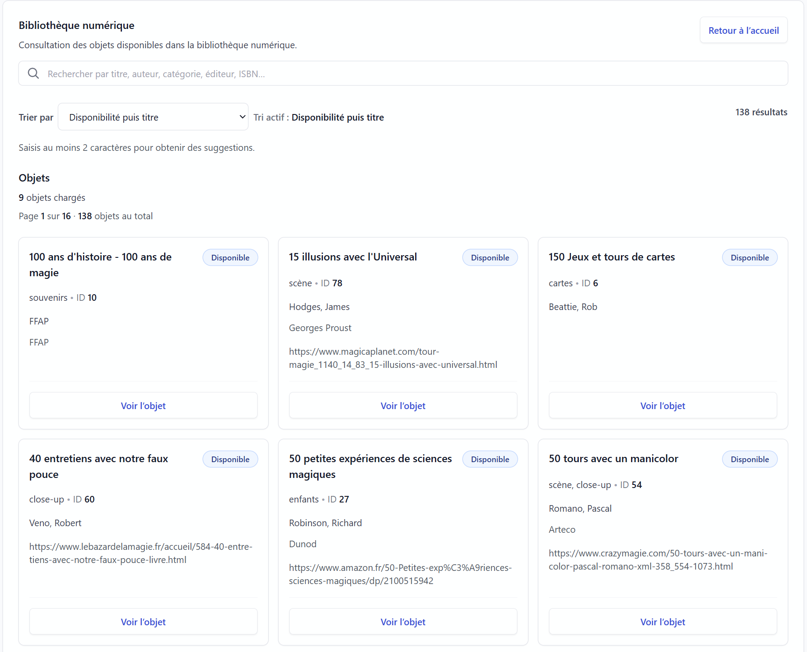
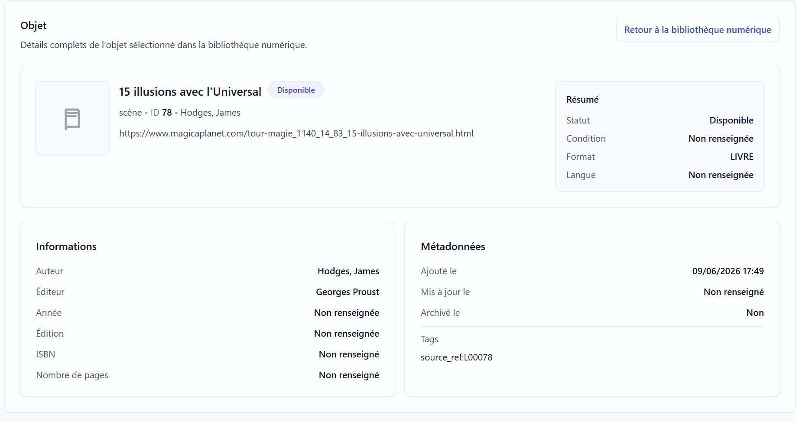
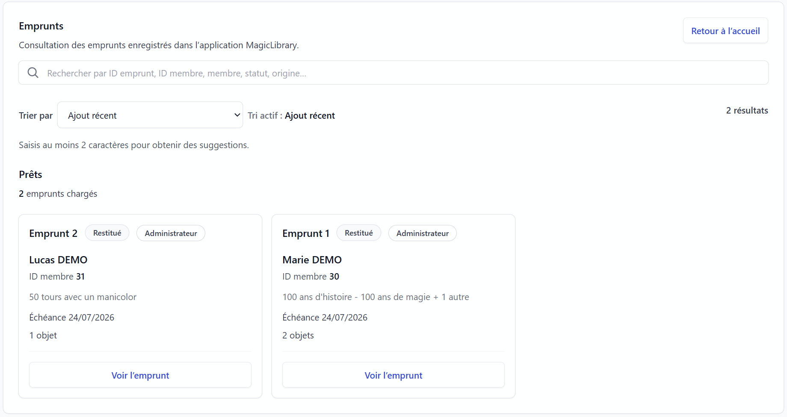
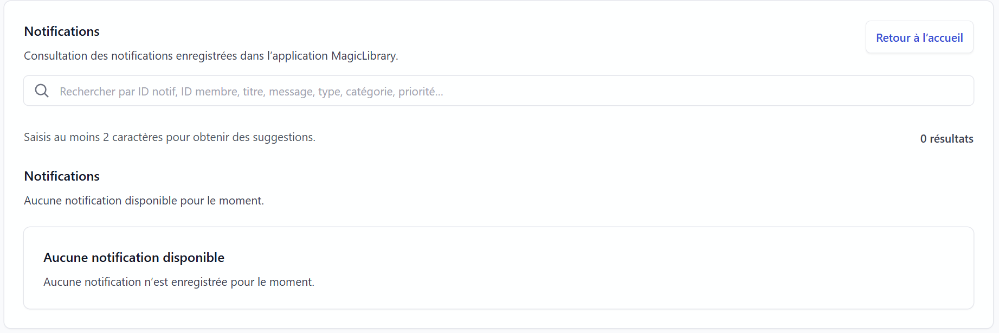
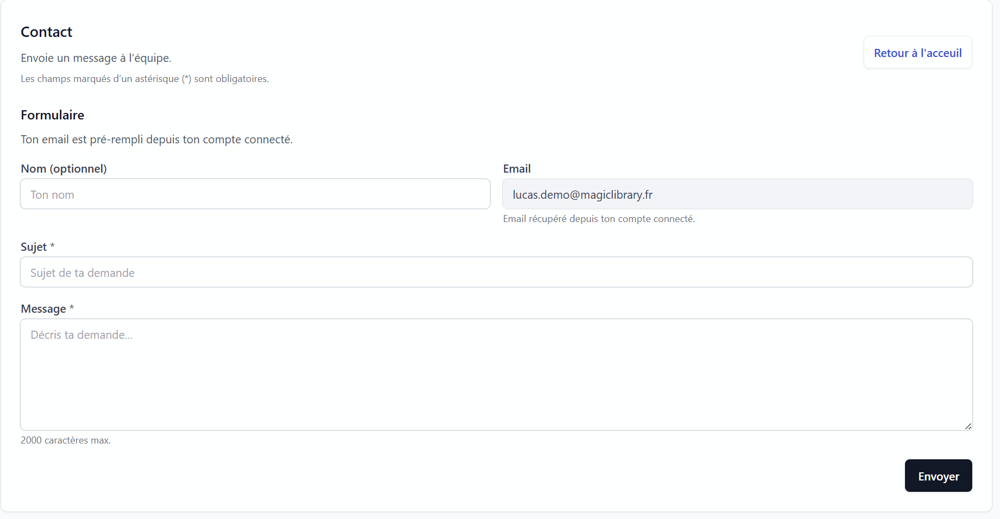
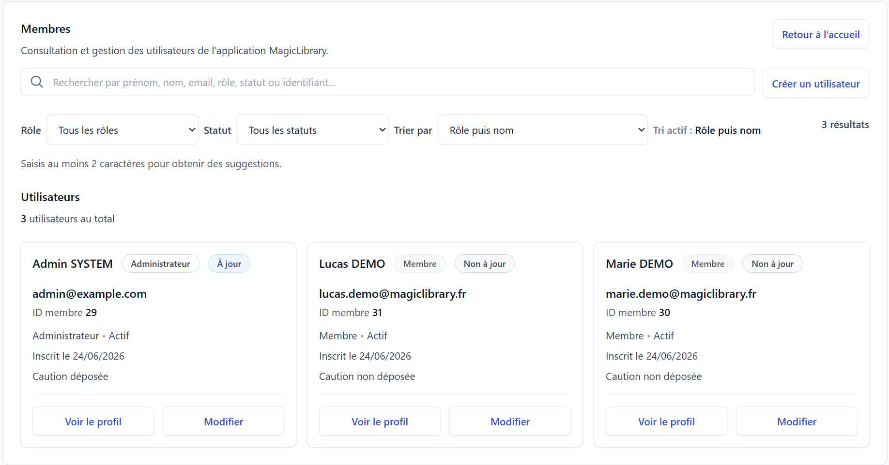

# 📚 MagicLibrary Backend

> Backend Spring Boot application for managing a thematic library (MagicLibrary)

---

## 🚀 Overview

MagicLibrary is a web application designed to manage a digital library system including items, loans, users, notifications and contact messages.

It is built as a REST backend with Spring Boot and follows a layered architecture.

---

## 🧱 Tech Stack

- Java 17+
- Spring Boot 3
- Spring Security (JWT authentication)
- Maven
- MariaDB / MySQL
- MongoDB (Contact module)
- REST API architecture

---

## 👤 Comptes de démonstration

### Admin
- Email: admin@example.com
- Password: Admin123!

### Member
- Email: lucas.demo@magiclibrary.fr
- Password: Demo123!

---

## 🔐 Authentication

- JWT-based authentication
- Roles:
  - ADMIN
  - MEMBER
  - GUEST

---

## 📦 Main Features

### 👤 User management
- Register / login
- Role-based access control

### 📚 Library catalog
- Manage items
- View available items

### 📦 Loan system
- Create loans
- Track borrowed items
- Manage loan status

### 🔔 Notifications
- User notifications
- Admin alerts

### 💬 Contact module (MongoDB)
- Send messages
- Admin responses

---

## 📸 Screenshots

### Login

### Home

### Catalog

### Item details

### Loans

### Notifications

### Contact

### Admin

---

## 🏗️ Architecture

Controller → Service → Repository → Database

- Clean layered architecture
- Separation of concerns
- RESTful API design

---

## ⚙️ Configuration

- application-dev.properties
- application-prod.properties

Default profile: dev

---

## ▶️ Run project

mvn clean install
mvn spring-boot:run

---

## 📁 Project Structure

src/main/java/com.magiclibrary/
- controller
- service
- repository
- security
- dto

src/main/resources/
- application.properties
- application-dev.properties
- application-prod.properties

---

## 🌐 Deployment

Compatible with:
- Railway
- Render
- Any Java Spring Boot hosting

---

## 📌 Status

- Backend functional
- Authentication implemented
- Database integration ready
- Demo-ready version

---

## 📄 License

Educational / portfolio project
